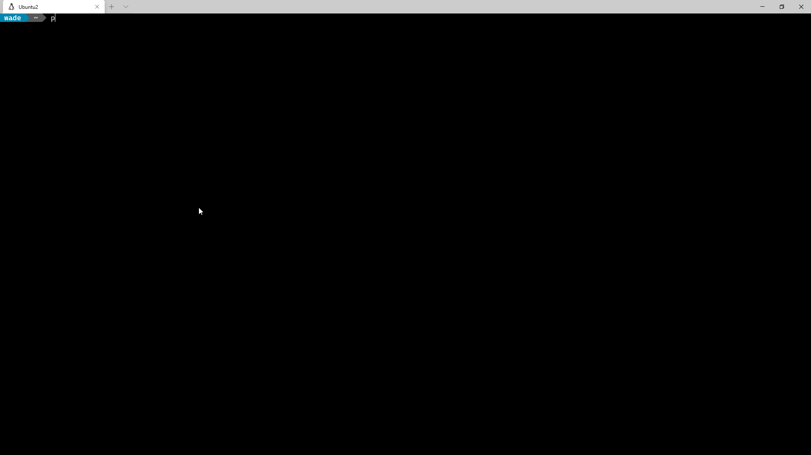

# Aruba Central API CLI

---

A CLI app for interacting with Aruba Central Cloud Management Platform. With cross-platform / shell support. Auto Completion, easy device/site/group/template identification (fuzzy match), support for batch import, and a lot more.



## Features
- Cross Platform Support
- Auto Completion
- Specify device, site, etc. by fuzzy match of multiple fields (i.e. name, mac, serial#, ip address)
- multiple output formats
- output to file
- Numerous import formats (csv, yaml, json, xls, etc.)
- multiple account support (easily switch between different central accounts `--account myotheraccount`)
- Batch Operation based on data from input file.  i.e. Add sites in batch based on data from a csv.
- Automatic Token refresh.  With prompt to paste in a new token if it becomes invalid.
  > If using Tokens, dedicate the token to the CLI alone, using it in swagger or on another system, will eventually lead to a refresh that invalidates the tokens on the other systems using it.
- You can also use username/Password Auth. which will facilitate autmatic retrieval of new Tokens even if they do become invalid.

## CURRENT STATE OF THE PROJECT

***evolving***  It's a useful tool, but as commands are built out the CLI hierarchy will evolve.  More batch automations, and orchistrated tasks are being added daily.  Please submit an issue with any requests.

## Installation

Requires python 3.7+ and pip

`pip3 install centralcli`

> You can also install in a virtual environment (venv), but you'll lose auto-completion, unless you activate the venv.

### if you don't have python

- You can get it for any platform @ https://www.python.org
- On Windows 10 it's also available in the Mirosoft store.


## Configuration

Refer to [config.yaml.example](config/config.yaml.example) to guide in the creation of config.yaml and place in the config directory.

CentralCli will look in \<Users home dir\>/.config/centralcli, and \<Users home dir\>\\.centralcli.
i.e. on Windows `c:\Users\wade\.centralcli` or on Linux `/home/wade/.config/centralcli`

Once `config.yaml` is populated per [config.yaml.example](config/config.yaml.example), run some test commands to validate the config.

For Example `cencli show all`

```bash
wade@wellswa6:~ $ cli show all
✔ Collecting Data [monitoring/v1/switches]
✔ Collecting Data [monitoring/v2/aps]
✔ Collecting Data [monitoring/v1/gateways]
name               ip               mac            model                 group          site     serial      type     labels       version                status
-----------------  ---------------  -------------  --------------------  -------------  -------  ----------  -------  -----------  ---------------------  --------
BR1_315_7c:88      10.101.6.200/24  --redacted--   315                   Branch1        Antigua  -redacted-  ap       Branch View  8.7.1.1_78245          Up
IAP305             10.2.30.102      --redacted--   305                   TemplateGroup           -redacted-  ap                    6.5.1.0-4.3.1.2_58595  Down
LABAP4             10.0.30.233/24   --redacted--   345                   WadeLab                 -redacted-  ap                    8.7.1.0_77203          Down
sw-zippity                          --redacted--   J9773A                WadeLab                 -redacted-  SW                    16.10.000x             Down
sw-ConsolePi-dev   10.0.10.154      --redacted--   Aruba2930F-(JL258A)   WadeLab        WadeLab  -redacted-  SW                    16.10.0011             Down
2930F-Branch1      10.101.5.4       --redacted--   Aruba2930F-(JL258A)   Branch1        Antigua  -redacted-  SW       Branch View  16.10.0007             Up
6200F-Bot          10.0.40.16       --redacted--   6200F 48G-(JL728A)    WadeLab        WadeLab  -redacted-  CX                    10.06.0010             Up
SDBranch1:7008     192.168.240.101  --redacted--   A7008                 Branch1        Antigua  -redacted-  gateway  Branch View  8.5.0.0-2.0.0.6_76205  Up
VPNC1              192.168.30.201   --redacted--   A7005                 WadeLab        WadeLab  -redacted-  gateway  Branch View  8.6.0.4-2.2.0.3_77966  Up
VPNC2              192.168.30.202   --redacted--   A7005                 WadeLab        WadeLab  -redacted-  gateway  Branch View  8.6.0.4-2.2.0.3_77966  Up
...

```

Use `cencli --help` to become familiar with the command options.

### Auto Completion
The CLI supports auto-completion.  To configure auto-completion run `cencli --install-completion`.  This will auto-detect the type of shell you are running in, and install the necessary completion into your profile.  You'll need to exit the shell and start a new session for it to take effect.

## Usage Notes:

### Caching & Friendly identifiers
- Caching: The CLI caches information on all devices, sites, groups, and templates in Central.  It's a minimal amount per device, and is done to allow human friendly identifiers.  The API typically accepts serial #, site id, etc.  This function allows you to specify a device by name, IP, mac (any format), and serial.

The lookup sequence for a device:

  1. Exact Match of any of the identifier fields (name, ip, mac, serial)
  2. case insensitive match
  3. case insensitive match disregarding all hyphens and underscores (in case you type 6200f_bot and the device name is 6200F-Bot)
  4. Case insensitive Fuzzy match with implied wild-card, otherwise match any devices that start with the identifier provided. `cencli show switches 6200F` will result in a match of `6200F-Bot`.


> If there is no match found, a cache update is triggered, and the match rules are re-tried.

- Caching works in a similar manner for groups, templates, and sites.  Sites can match on name and nearly any address field.  So if you only had one site in San Antonio you could specify that site with `show sites 'San Antonio'`  \<-- Note the use of quotes because there is a space in the name.

- **Multiple Matches**:  It's possible to specify an identifier that returns multiple matches (if drops all the way down to the Fuzzy match/implied trailing wild-card).  If that occurs you are prompted to select the intended device from a list of the matches.

### Output Formats

There are a number of output formats available.  Most commands default to what is likely the easiest to view given the number of fields.  Otherwise longer outputs are typically displayed vertically by default.  If the output can reasonably fit, it's displayed in tabular format horizontally.

You can specify the output format with command line flags `--json`, `--yaml`, `--csv`, `--table`  rich is tabular format with folding (multi line within the same row) and truncating.

> Most outputs will evolve to support an output with the most commonly desired fields by default and expanded vertical output via the `-v` option (not implemented yet.).  Currently the output is tabular horizontally if the amount of data is likely to fit most displays, and vertical otherwise.

### File Output

Just use `--out \<filename\>` (or \<path\\filename\>), and specify the desired format.

## CLI Tree

Use `--help`, which you can do at any level.  `cli --help`, `cli do --help` etc.  A Tree will be documented here once it's built out more.

## Project Structure

```bash
    ├── centralcli
    │   ├── boilerplate             # Boilerplate code generated via custom script from JSON schema files.
    │   │   ├── allcalls.py         # Any methods used by centralcli are pulled out and placed in central.py
    │   │   ├── configuration.py    # for now, central.py will eventually be broken out into diff modules.
    │   │   ├── firmware.py
    │   │   ├── guest.py
    │   │   └── wlan.py
    │   ├── caas.py                 # Working caas API module, `cencli caas ...` (hidden command)
    │   ├── cache.py                # Local caching module facilitates use of device name / fuzzy match in commands
    │   ├── central.py              # The module that with the async API calls for Aruba Central
    │   ├── cleaner.py              # cleaner/parser module, cleans up output.
    │   ├── cli.py                  # *The centralcli __main__ script*
    │   ├── cliadd.py               # `cencli add ...` level of the cli
    │   ├── clibatch.py             # `cencli batch ...` level of the cli
    │   ├── clicaas.py              # `cencli caas ...` level of the cli (hidden)
    │   ├── clicommon.py            # Common class used by all cli levels (callbacks and output display)
    │   ├── clidel.py               # `cencli delete ...` level of the cli
    │   ├── clido.py                # `cencli do ...` level of the cli.  These commands will move to level 1 eventually.
    │   ├── clishow.py              # `cencli show ...` level of the cli
    │   ├── cliupdate.py            # `cencli update ...` level of the cli
    │   ├── config.py               # config module reads centralcli config file / and any import files.
    │   ├── constants.py            # static variables and type deffinitions
    │   ├── exceptions.py           # Not Used Currently: Custom CentralApi exceptions
    │   ├── logger.py               # centralcli log module (logging)
    │   ├── response.py             # CentralApi response module.  Wraps aiohttp response and any other data sent to
    │   │                           #    Response() object.  Provides consistent set of attributes for eval during
    │   │                           #    display.
    │   ├── setup.py                # for pytest
    │   ├── utils.py                # Utils object with convenience methods.  A class just for the sake of namespace.
    │   └── vscodeargs.py           # dev helper.  Breaks single argument (how vscode represents args) into
    │   │                           #   multiple arguments (vscode debugger)
    ├── config                      # dev configuration directory (when running from git cloned repo)
    │   ├── config.yaml             # pip installed version will use $HOME/.config/centralcli on POSIX or %HOME%\.centralcli on Win
    │   ├── config.yaml.example
    ├── docs
    │   ├── Makefile
    │   ├── conf.py
    │   ├── img
    │   │   └── cencli-demo.gif
    │   ├── index.rst
    │   └── make.bat
    ├── poetry.lock
    ├── pyproject.toml
    ├── requirements-dev.txt
    ├── requirements.txt
    └── tests
        ├── test_devices.json
        ├── test_devices.json.example
        ├── test_do.py
        └── test_show.py
```
